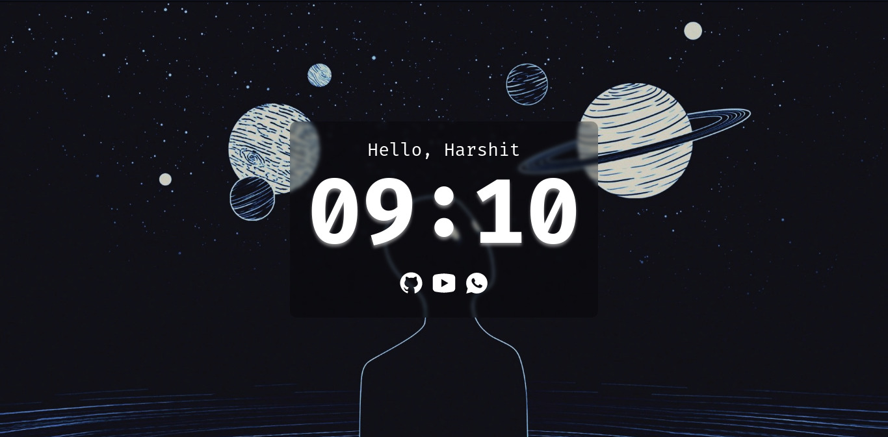
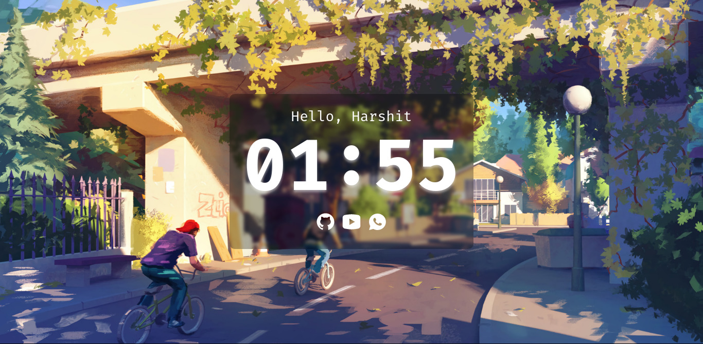
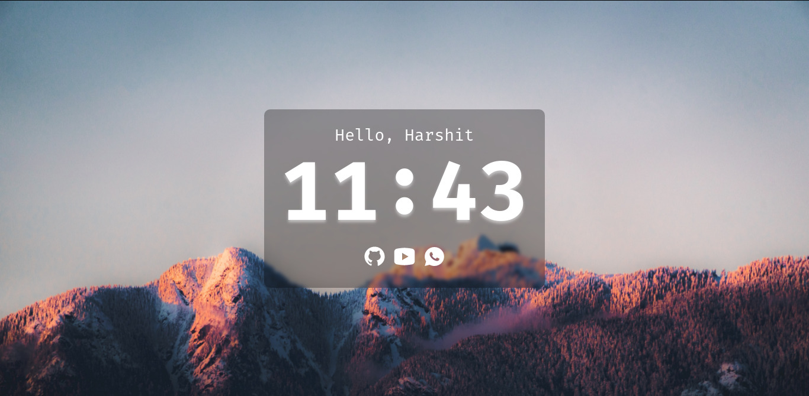

A themed, minimal start page for web browsers.

## Installation

### For Chromium-based browsers
- clone this repository `git clone https://github.com/Harshit-T/nightly.git`.
- Download [New Tab Redirect](https://chrome.google.com/webstore/detail/new-tab-redirect/icpgjfneehieebagbmdbhnlpiopdcmna).
- Go to Extension settings and add path to index.html as Redirect URL. for example, `file://path/to/file/index.html`

### For Firefox
- clone this repository `git clone https://github.com/Harshit-T/nightly.git`.
- Download [New Tab Override](https://addons.mozilla.org/en-US/firefox/addon/new-tab-override/).
- Go to Extension settings and add path to index.html as Redirect URL. for example, `file://path/to/file/index.html`

## Previews

	

